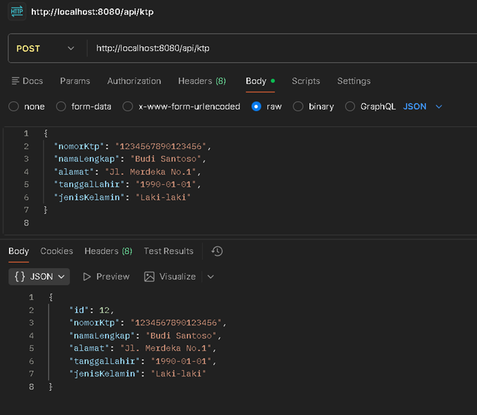
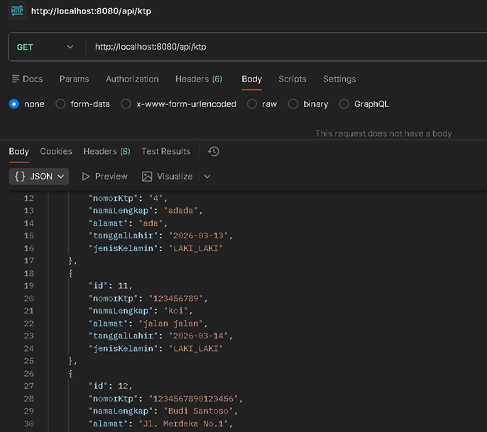
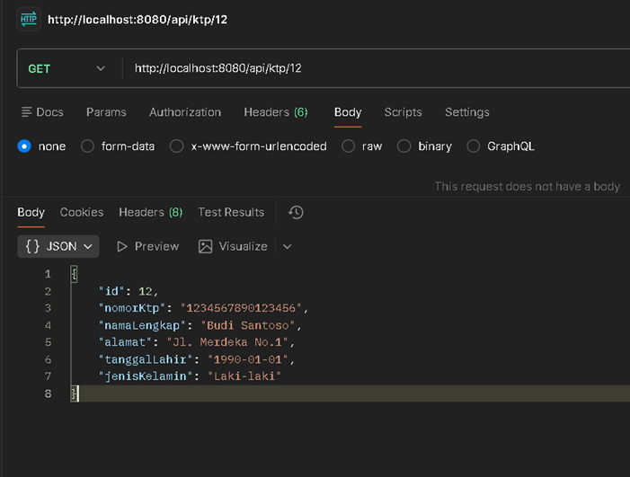
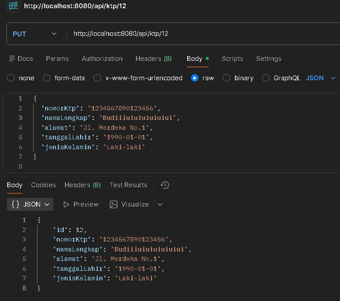
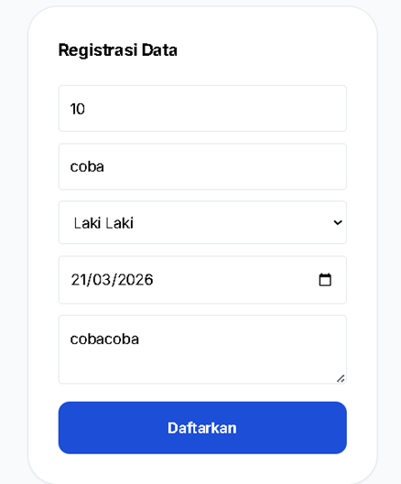
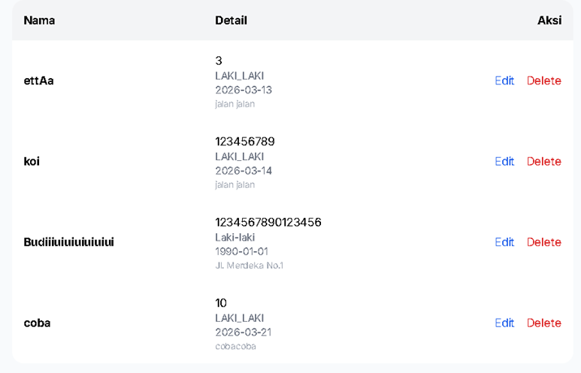
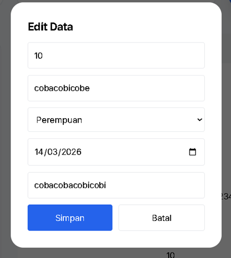
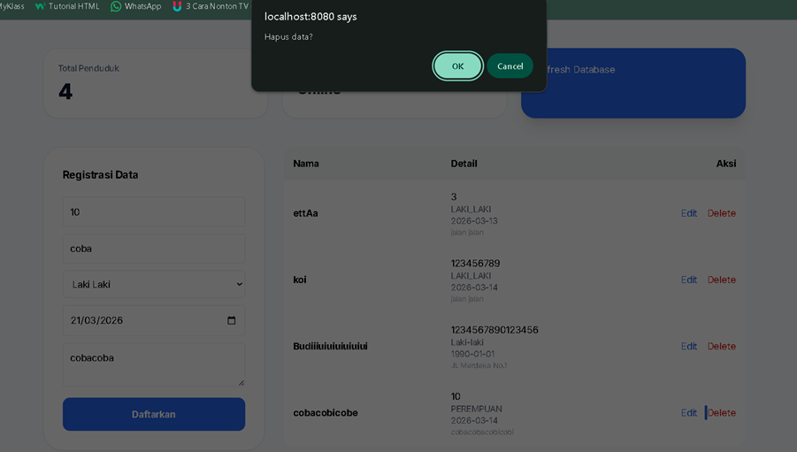

#
Dokumentasi KTP API

##

Dokumentasi ini menjelaskan tentang endpoint Rest API yang digunakan untuk melakukan manajemen data KTP,dengan prose CREATE,READ,UPDATE,DELETE.

BASE URL API: 
http://localhost:8080

##

1. CREATE KTP
#####
Digunakan untuk menambahkan data KTP baru

Endpoint:

POST /ktp

Full URL:

http://localhost:8080/ktp

Request Body (JSON):
{
  "nomorKtp": "1234567890123456",
  "namaLengkap": "Budi Santoso",
  "alamat": "Jl. Merdeka No.1",
  "tanggalLahir": "1990-01-01",
  "jenisKelamin": "Laki-laki"
}

Response :

Keterangan:

Sistem akan otomatis membuat ID (Auto Increment) untuk data KTP baru dan menyimpannya ke database

#
2. Tampilkan Semua KTP (Read All KTP)

Digunakan untuk mengambil seluruh data KTP yang tersimpan di database.

Endpoint:

GET /ktp

Full URL:

http://localhost:8080/ktp

Response :

Keterangan:

Jika tidak ada data, response akan berupa array kosong [ ].
#
3. Cari KTP Berdasarkan ID (Read KTP by ID)

Digunakan untuk mengambil data KTP tertentu berdasarkan ID.

Endpoint:

GET /ktp/{id}

Contoh URL:

http://localhost:8080/ktp/12

Response Berhasil:

#
4. Perbarui Data KTP (Update KTP)

Digunakan untuk memperbarui data KTP yang sudah ada.

Endpoint:

PUT /ktp/{id}

Full URL:

http://localhost:8080/ktp/12

Request Body (JSON):
{
  "nomorKtp": "1234567890123456",
  "namaLengkap": "Budiiiuiuiuiuiuiui",
  "alamat": "Jl. Merdeka No.10",
  "tanggalLahir": "1990-01-01",
  "jenisKelamin": "Laki-laki"
}

Response :

Keterangan:

Data lama akan diperbarui sesuai input terbaru. ID KTP tidak berubah.
#
5. Hapus Data KTP (Delete KTP)

Digunakan untuk menghapus data KTP berdasarkan ID.

Endpoint:

DELETE /ktp/{id}

Full URL:

http://localhost:8080/api/ktp/4 

Response (Contoh):

{
  "status": "success",
  "message": "Data berhasil dihapus"
}

Keterangan:

Data KTP akan dihapus dari database jika ID ditemukan. Jika ID tidak ada → response error 404.
#
CRUD Web (Client-side)
1. Tambah Data KTP

Form untuk menambah data KTP baru.

2. Tampilkan Semua Data KTP

Tabel menampilkan semua data KTP.

3. Update Data KTP

Edit data KTP langsung via form/modal.

4. Hapus Data KTP

Hapus data KTP dengan dialog konfirmasi.